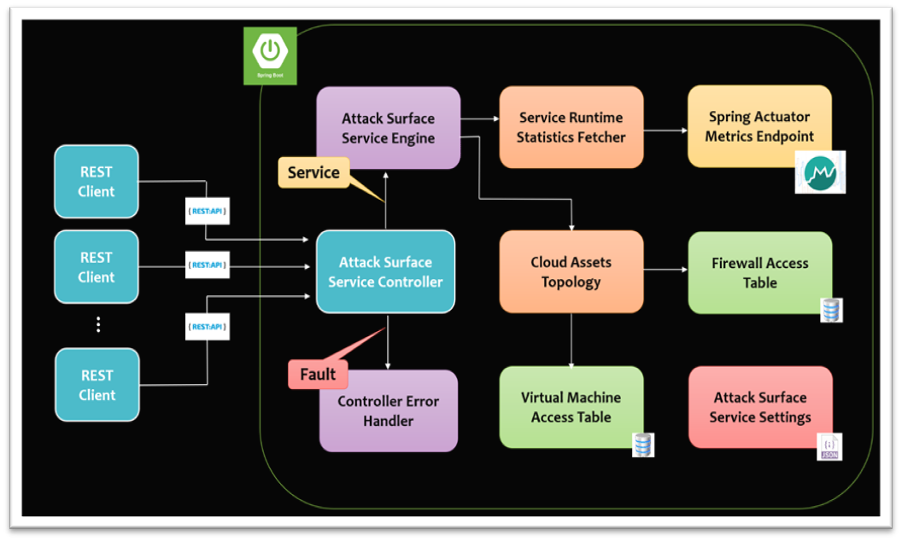

# Abstract

Orca Security delivers the industry-leading Cloud Security Platform that identifies, prioritizes, and remediates security risks and compliance issues across various cloud estates, spanning AWS, Azure, GCP and K8s.

The Orca Platform connects to a given cloud environment and provides complete coverage across all cloud risks – spanning misconfigurations, vulnerabilities, identity, data security, and advanced threats. In that matter, a fundamental platform capability is to scan the tenant environment and identify the potential attack vectors risking their cloud assets (denoted as Attack Surfaces).

The Breacher service forms a backbone of the aforementioned business initiative. With Breacher, tenants can easily subscribe and analyze the attack surface of a specified cloud asset - meaning which other virtual machines can access and potentially attack it - while eliminating performance, compatibility, and security gaps.

# Documentation

See 'docs' directory for the key project details, including all the supporting documents created over the course of the project. In particular, it explains the architectural design concepts used to development Breacher.



# Build & Distribute

Breacher is based around the central concept of the Maven Build Lifecycle. What this means is that the process for building and distributing a particular Breacher artifact is clearly defined. 
To ship a new artifact, install Java & Maven on Windows / Linux / Mac. 

The default lifecycle consists of the following phases:

1. Validate - validate the project is correct and all necessary information is available.
2. Compile - compile the source code of the project. 
3. Test - test the compiled source code using Spring JUnit. These tests form a gate for PR approvals. 
4. Package - take the compiled code and package it in its distributable format (JAR). 
5. Verify - run any checks on results of integration tests to ensure quality criteria are met.
6. Install - install the package into the local repository, for use as a dependency in other projects locally.

Use the following command to cleanly build and install artifacts into your local repository:

```bash
mvn clean install
```

# Service Execution

To execute the locally built artifact, navigate to the root of the project via command line and execute:

```bash
mvn spring-boot:run -Dspring-boot.run.arguments="<absolute-path-to-cloud-environment-file>"
```

To execute the published official artifact, download the RC package and execute:

```bash
java -jar target/Breacher.jar <absolute-path-to-cloud-environment-file>
```

# Calling REST Endpoints

Using the /attack endpoint via CLI:

```bash
curl http://localhost/api/v1/attack?vm_id=<Cloud-Asset-Identifier>
```

Using the /stats endpoint via CLI:

```bash
curl http://localhost/api/v1/stats
```

Monitoring via Spring Actuator:

```bash
curl http://localhost/actuator
```

# Known Issues

1. When using the Spring Actuator for metric collection, and following the guide of spring boot 2.2.6 - the “http.server.requests” will not be shown in the metrics list if no valid REST requests have happened so far.
After making the first REST request, the HTTP metric becomes available. In our case, the /stats endpoint will become available after properly initiating an /attack request.


2. To locate computing bottlenecks within Breacher, and determine whether it satisfies performance requirements (for instance, handling up to 1,000 concurrent requests) - the system should have been tested against heavy performance benchmarks. Due to time constraints, stress testing didn't take place.


